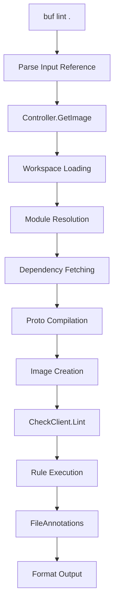

# Understanding Buf: Architecture and Core Concepts

**Series:** Buf Deep Dive (1 of 6)
**Commit SHA:** `e68c306ab3b6c39eef5abc23725d3e33d4a49cd4`

---

## What You'll Learn

- Buf's layered hexagonal architecture
- Core abstractions: Module, Image, Workspace, Controller
- How the CLI processes commands
- Key design decisions and trade-offs

---

## Introduction

Buf has quietly become the industry standard for Protocol Buffer development, but what makes it tick? In this first post of our deep-dive series, we'll explore the architecture that enables Buf to be fast, extensible, and developer-friendly.

We'll examine the codebase at commit [`e68c306`](https://github.com/bufbuild/buf/tree/e68c306ab3b6c39eef5abc23725d3e33d4a49cd4), which represents v1.60.1-dev. The patterns we'll discover are mature and battle-tested across thousands of production deployments.

---

## The Big Picture: Layered Hexagonal Architecture

Buf follows a **Layered Hexagonal Architecture** (also known as Ports and Adapters), combined with dependency injection through the Provider pattern. This isn't accidental - it's a deliberate choice that enables:

1. **Testability** - Each layer can be tested in isolation
2. **Extensibility** - New features plug in without modifying core logic
3. **Maintainability** - Clear boundaries prevent spaghetti code

Here's how the layers stack up:

```
┌─────────────────────────────────────────────┐
│        CLI Layer (cmd/buf/)                 │  ← User Interface
│   Commands, flags, output formatting        │
├─────────────────────────────────────────────┤
│     Application Layer (bufctl/)             │  ← Orchestration
│   Controller coordinates all operations     │
├─────────────────────────────────────────────┤
│       Domain Layer (bufpkg/)                │  ← Business Logic
│   Modules, Images, Check rules, Config      │
├─────────────────────────────────────────────┤
│    Infrastructure Layer (pkg/)              │  ← External Services
│   Storage, Git, HTTP, Authentication        │
└─────────────────────────────────────────────┘
```

---

## Entry Point: Where It All Begins

Every `buf` command starts at [`cmd/buf/buf.go`](https://github.com/bufbuild/buf/blob/e68c306ab3b6c39eef5abc23725d3e33d4a49cd4/cmd/buf/buf.go). Let's trace the execution:

```go
// cmd/buf/buf.go:43-52
func main() {
    ctx := context.Background()
    // Intercepts SIGTERM/SIGINT for graceful shutdown
    ctx, cancel := signal.NotifyContext(ctx, syscall.SIGTERM, syscall.SIGINT)
    defer cancel()

    appcmd.Main(ctx, newRootCommand("buf"))
}
```

The `newRootCommand` function builds the entire command tree. Notice how it uses `appext.Builder` to wire up logging, error handling, and common infrastructure:

```go
// cmd/buf/buf.go:78-95
func newRootCommand(name string) *appcmd.Command {
    builder := appext.NewBuilder(
        name,
        appext.BuilderWithLoggerProvider(slogapp.LoggerProvider),
        appext.BuilderWithInterceptor(newErrorInterceptor()),
    )

    return &appcmd.Command{
        Use: name,
        SubCommands: []*appcmd.Command{
            build.NewCommand("build", builder),
            lint.NewCommand("lint", builder),
            breaking.NewCommand("breaking", builder),
            generate.NewCommand("generate", builder),
            // ... 20+ more commands
        },
    }
}
```

**Design Decision:** Buf uses `spf13/cobra` for CLI parsing but wraps it in `appcmd` for additional control over lifecycle and error handling.

---

## The Controller: Central Orchestrator

The heart of Buf is the [`Controller`](https://github.com/bufbuild/buf/blob/e68c306ab3b6c39eef5abc23725d3e33d4a49cd4/private/buf/bufctl/controller.go) - a facade that coordinates all operations. Every command eventually talks to the Controller.

```go
// private/buf/bufctl/controller.go:89-120
type Controller interface {
    // GetWorkspace loads a workspace from an input reference
    GetWorkspace(ctx context.Context, input string, options ...WorkspaceOption) (bufworkspace.Workspace, error)

    // GetImage compiles protos to an image
    GetImage(ctx context.Context, input string, options ...GetImageOption) (bufimage.Image, error)

    // GetTargetModuleKeys resolves target modules
    GetTargetModuleKeys(ctx context.Context, input string) ([]bufmodule.ModuleKey, error)

    // PutImage writes an image to output
    PutImage(ctx context.Context, output string, image bufimage.Image, options ...PutImageOption) error

    // ... and many more
}
```

**Why a Controller?** Instead of commands directly calling domain services, they go through the Controller. This provides:

1. **Consistent error handling** - Errors are wrapped with context
2. **Shared caching** - Module and image caches are managed centrally
3. **Unified configuration** - Settings are loaded once and shared
4. **Simplified testing** - Mock the Controller to test commands

Here's how a command uses the Controller:

```go
// cmd/buf/internal/command/lint/lint.go (simplified)
func run(ctx context.Context, container appext.Container, input string) error {
    controller, err := bufctl.NewController(
        container,
        bufctl.WithModuleKeyProvider(moduleKeyProvider),
        // ... options
    )
    if err != nil {
        return err
    }

    // Get compiled image
    image, err := controller.GetImage(ctx, input)
    if err != nil {
        return err
    }

    // Run lint checks
    annotations, err := checkClient.Lint(ctx, image.Files())
    // ... handle results
}
```

---

## Core Abstraction #1: Module

A **Module** is the fundamental unit of organization in Buf. It's a collection of .proto files with metadata, similar to a package in other ecosystems.

```go
// private/bufpkg/bufmodule/module.go (conceptual interface)
type Module interface {
    // ModuleKey returns the unique identifier (e.g., buf.build/owner/repo)
    ModuleKey() ModuleKey

    // ModuleFullName returns the full name including version
    ModuleFullName() ModuleFullName

    // Files returns all proto files in the module
    Files() []ModuleFile

    // Deps returns declared dependencies
    Deps() []ModuleDep
}
```

Modules are typically loaded from:
- Local directories
- Git repositories
- BSR (Buf Schema Registry)
- Archives (tar, zip)

The [`ModuleKey`](https://github.com/bufbuild/buf/blob/e68c306ab3b6c39eef5abc23725d3e33d4a49cd4/private/bufpkg/bufmodule/module_key.go) uniquely identifies a module:

```go
// Format: registry/owner/repository
// Example: buf.build/googleapis/googleapis
type ModuleKey interface {
    String() string
    Registry() string
    Owner() string
    Repository() string
}
```

---

## Core Abstraction #2: Image

An **Image** is the compiled representation of Protobuf files. Think of it as the "bytecode" of Protocol Buffers - it contains all type information resolved and ready for use.

```go
// private/bufpkg/bufimage/bufimage.go
type Image interface {
    // Files returns all FileDescriptors in the image
    Files() []ImageFile

    // GetFile retrieves a specific file by path
    GetFile(path string) (ImageFile, bool)

    // SourceCodeInfo returns preserved source comments and locations
    SourceCodeInfo() bool
}

type ImageFile interface {
    // FileDescriptor is the compiled protobuf representation
    FileDescriptor() protodesc.FileDescriptor

    // Path returns the file path
    Path() string

    // ModuleKey returns which module this file belongs to
    ModuleKey() ModuleKey
}
```

Images can be serialized to binary format for:
- Caching compilation results
- Sharing between tools
- Input to code generators

The compilation pipeline:

```
.proto files → Parse → Compile → FileDescriptors → Image
```

---

## Core Abstraction #3: Workspace

A **Workspace** manages multiple modules and their dependencies. It's defined by `buf.work.yaml`:

```yaml
version: v2
modules:
  - path: proto/user
  - path: proto/order
  - path: proto/common
```

The workspace handles:
- Module discovery from paths
- Dependency resolution (transitive)
- Target selection for operations
- Path mapping between modules

```go
// private/buf/bufworkspace/workspace.go (conceptual)
type Workspace interface {
    // Modules returns all modules in the workspace
    Modules() []bufmodule.Module

    // GetModule retrieves a module by key
    GetModule(key bufmodule.ModuleKey) (bufmodule.Module, bool)

    // AllFileInfos returns info for all proto files
    AllFileInfos() []FileInfo
}
```

---

## The Provider Pattern: Dependency Injection Without Frameworks

One of Buf's most elegant patterns is the **Provider pattern** for dependency injection. Instead of using a DI framework, interfaces define "providers" that can be injected.

```go
// Common provider pattern in Buf
type ModuleDataProvider interface {
    GetModuleData(ctx context.Context, key ModuleKey) (ModuleData, error)
}

type GraphProvider interface {
    GetGraph(ctx context.Context) (*dag.Graph[ModuleKey, Module], error)
}
```

This appears throughout the codebase:

```go
// private/buf/bufworkspace/workspace_provider.go
type WorkspaceProvider interface {
    GetWorkspaceForBucket(
        ctx context.Context,
        bucket storage.ReadBucket,
        options ...WorkspaceOption,
    ) (Workspace, error)
}
```

**Benefits over DI frameworks:**
1. **Explicit dependencies** - No magic, all deps are visible in function signatures
2. **Compile-time safety** - Missing implementations fail at compile time
3. **Easy mocking** - Test implementations are straightforward
4. **No reflection** - Better performance and smaller binaries

---

## Error Handling: FileAnnotations

Buf has a sophisticated error system for compiler/linter errors called **FileAnnotations**:

```go
// private/bufpkg/bufanalysis/bufanalysis.go
type FileAnnotation interface {
    // FileInfo returns file location
    FileInfo() FileInfo

    // StartLine returns the line number (1-indexed)
    StartLine() int

    // StartColumn returns the column (1-indexed)
    StartColumn() int

    // Message returns the error message
    Message() string

    // Type returns the rule ID (e.g., "FIELD_LOWER_SNAKE_CASE")
    Type() string
}
```

When a lint check fails, it returns FileAnnotations rather than plain errors. This enables:
- Multiple errors per run
- Precise source locations
- Structured output (JSON, GitHub Actions format)
- Aggregation across files

The CLI formats these for different output targets:

```go
// Exit code 100 specifically for lint/breaking failures
const ExitCodeFileAnnotation = 100
```

---

## Data Flow: From Input to Output

Let's trace how `buf lint` processes a directory:



In code terms:

1. **Input Parsing** - `buffetch` parses "." into a bucket reference
2. **Workspace Loading** - `bufworkspace` discovers modules
3. **Module Resolution** - Resolve dependencies from BSR or local
4. **Compilation** - `protocompile` compiles to FileDescriptors
5. **Image Creation** - Wrap descriptors in Image abstraction
6. **Lint Execution** - `bufcheck.Client.Lint()` runs rules
7. **Output** - Format FileAnnotations for display

---

## Trade-offs and Design Decisions

### Why Hexagonal over Simpler Patterns?

**Trade-off:** More abstraction layers vs. flexibility

Buf chose hexagonal architecture because:
- Multiple input sources (files, git, BSR, archives)
- Multiple output formats (text, json, junit)
- Plugin extensibility requirement
- Need for comprehensive testing

A simpler layered architecture would be harder to test and extend.

### Why Provider Pattern over DI Framework?

**Trade-off:** More boilerplate vs. explicitness

Buf's Provider pattern means more interface definitions, but:
- No hidden magic
- Zero runtime overhead
- Compile-time safety
- Easy to understand

### Why Custom Error Types (FileAnnotation)?

**Trade-off:** More complex error handling vs. rich diagnostics

Plain `error` would be simpler, but FileAnnotations enable:
- Multiple errors per run (don't stop at first error)
- Precise source locations
- Machine-readable output
- IDE integration (LSP)

---

## Key Takeaways

1. **Layered Hexagonal Architecture** separates concerns into CLI, Application, Domain, and Infrastructure layers

2. **The Controller** is the central orchestrator that all commands use

3. **Core abstractions** (Module, Image, Workspace) model the Protobuf domain

4. **Provider pattern** enables dependency injection without frameworks

5. **FileAnnotations** provide rich error information for diagnostics

---

## What's Next

In Post 2, we'll dive deep into the **linting and breaking change detection system** - exploring how 40+ lint rules and 53+ breaking rules are implemented and executed.

---

## Code References

- Entry point: [`cmd/buf/buf.go`](https://github.com/bufbuild/buf/blob/e68c306ab3b6c39eef5abc23725d3e33d4a49cd4/cmd/buf/buf.go)
- Controller: [`private/buf/bufctl/controller.go`](https://github.com/bufbuild/buf/blob/e68c306ab3b6c39eef5abc23725d3e33d4a49cd4/private/buf/bufctl/controller.go)
- Module: [`private/bufpkg/bufmodule/module.go`](https://github.com/bufbuild/buf/blob/e68c306ab3b6c39eef5abc23725d3e33d4a49cd4/private/bufpkg/bufmodule/module.go)
- Image: [`private/bufpkg/bufimage/bufimage.go`](https://github.com/bufbuild/buf/blob/e68c306ab3b6c39eef5abc23725d3e33d4a49cd4/private/bufpkg/bufimage/bufimage.go)
- FileAnnotation: [`private/bufpkg/bufanalysis/bufanalysis.go`](https://github.com/bufbuild/buf/blob/e68c306ab3b6c39eef5abc23725d3e33d4a49cd4/private/bufpkg/bufanalysis/bufanalysis.go)

---

*Continue to Post 2: Deep Dive - Linting and Breaking Change Detection →*
