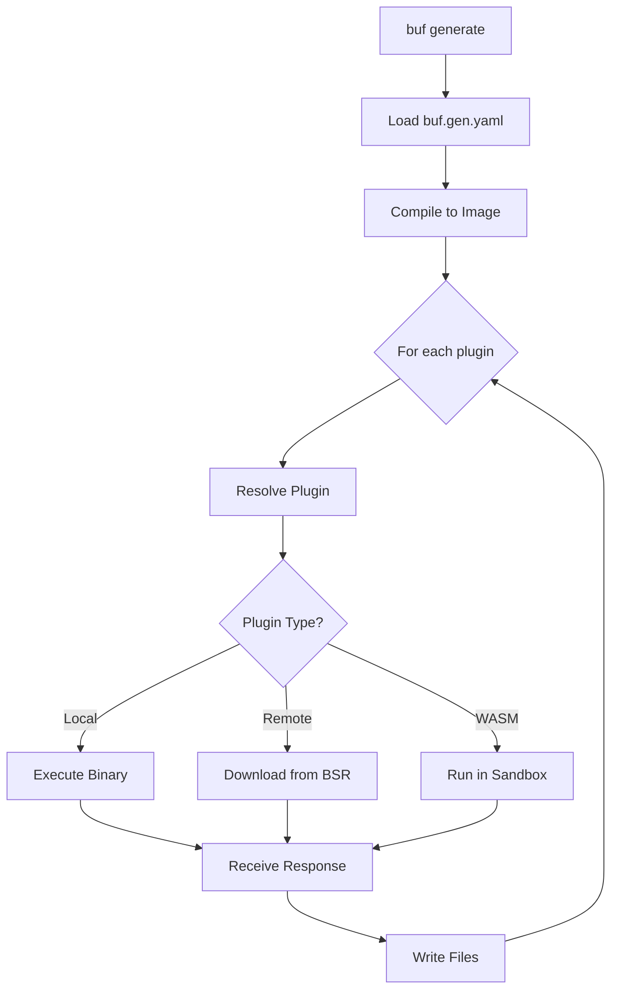

# Extending and Integrating Buf

**Series:** Buf Deep Dive (4 of 6)
**Commit SHA:** `e68c306ab3b6c39eef5abc23725d3e33d4a49cd4`

---

## What You'll Learn

- Plugin architecture (local, remote, WASM)
- Code generation pipeline
- BSR API integration
- Building custom lint rules

---

## Introduction

Buf isn't just a tool - it's a platform. Its extension points allow you to integrate with your toolchain, add custom rules, and build automation on top of the BSR API.

In this post, we'll explore how to extend Buf with plugins and integrate it with external systems.

---

## Plugin Architecture Overview

Buf supports three types of plugins:

| Type | Description | Use Case |
|------|-------------|----------|
| **Local** | Binary on your machine | Development, custom tools |
| **Remote** | Downloaded from BSR | Team-shared plugins |
| **WASM** | WebAssembly modules | Sandboxed, portable |

```
┌─────────────────────────────────────────────────────┐
│                 buf generate                         │
└─────────────────────┬───────────────────────────────┘
                      │
          ┌───────────┼───────────┐
          │           │           │
          v           v           v
     ┌────────┐  ┌────────┐  ┌────────┐
     │ Local  │  │ Remote │  │  WASM  │
     │ Plugin │  │ Plugin │  │ Plugin │
     └────────┘  └────────┘  └────────┘
```

---

## Code Generation Pipeline

### Configuration

Code generation is configured in `buf.gen.yaml`:

```yaml
version: v2
plugins:
  - remote: buf.build/protocolbuffers/go
    out: gen/go
    opt:
      - paths=source_relative

  - remote: buf.build/grpc/go
    out: gen/go
    opt:
      - paths=source_relative

  - local: protoc-gen-custom
    out: gen/custom
```

### The Generator

The [`Generator`](https://github.com/bufbuild/buf/blob/e68c306ab3b6c39eef5abc23725d3e33d4a49cd4/private/buf/bufgen/generator.go) orchestrates plugin execution:

```go
// private/buf/bufgen/generator.go (simplified)
type Generator interface {
    Generate(
        ctx context.Context,
        image bufimage.Image,
        options ...GenerateOption,
    ) error
}

func (g *generator) Generate(ctx context.Context, image Image) error {
    for _, pluginConfig := range g.config.Plugins {
        // Resolve plugin (local, remote, or WASM)
        plugin, err := g.resolvePlugin(ctx, pluginConfig)
        if err != nil {
            return err
        }

        // Execute plugin with image
        response, err := g.executePlugin(ctx, plugin, image)
        if err != nil {
            return err
        }

        // Write generated files
        err = g.writeResponse(ctx, pluginConfig.Out, response)
        if err != nil {
            return err
        }
    }
    return nil
}
```

### Plugin Execution Flow



---

## Remote Plugins

### How Remote Plugins Work

Remote plugins are stored on BSR and downloaded on first use:

```yaml
plugins:
  - remote: buf.build/protocolbuffers/go:v1.28.1
    out: gen
```

Under the hood:

```go
// private/bufpkg/bufremoteplugin/bufremoteplugin.go (conceptual)
func (p *pluginProvider) GetPlugin(ctx context.Context, ref PluginRef) (Plugin, error) {
    // Check local cache
    if plugin, ok := p.cache.Get(ref); ok {
        return plugin, nil
    }

    // Download from BSR
    pluginData, err := p.registryClient.GetPlugin(ctx, ref)
    if err != nil {
        return nil, err
    }

    // Cache for future use
    p.cache.Put(ref, pluginData)

    return pluginData, nil
}
```

### Docker-Based Execution

Remote plugins can run in Docker containers:

```go
// private/bufpkg/bufremoteplugin/bufremoteplugindocker/docker.go
func (e *dockerExecutor) Execute(
    ctx context.Context,
    plugin Plugin,
    request *pluginpb.CodeGeneratorRequest,
) (*pluginpb.CodeGeneratorResponse, error) {
    // Create container with plugin image
    container, err := e.client.CreateContainer(ctx, plugin.Image())
    if err != nil {
        return nil, err
    }
    defer e.client.RemoveContainer(ctx, container)

    // Mount input/output volumes
    // Execute plugin
    // Return response
}
```

---

## WASM Plugins

WebAssembly plugins run in a sandboxed environment using [wazero](https://github.com/tetratelabs/wazero):

```go
// private/bufpkg/bufremoteplugin/bufremotepluginwasm/wasm.go (conceptual)
func (e *wasmExecutor) Execute(
    ctx context.Context,
    wasmBytes []byte,
    request *pluginpb.CodeGeneratorRequest,
) (*pluginpb.CodeGeneratorResponse, error) {
    // Create WASM runtime
    runtime := wazero.NewRuntime(ctx)
    defer runtime.Close(ctx)

    // Instantiate module
    module, err := runtime.Instantiate(ctx, wasmBytes)
    if err != nil {
        return nil, err
    }

    // Call generate function
    // Parse response
}
```

**Benefits of WASM:**
- Sandboxed execution (no filesystem access)
- Portable across platforms
- Fast startup (no container overhead)

---

## Building Custom Lint Rules

### Plugin Structure

Custom lint rules follow the check plugin protocol:

```go
// custom-lint-plugin/main.go
package main

import (
    "buf.build/go/bufplugin/check"
)

func main() {
    spec := check.NewSpec(
        check.SpecWithRules(
            &check.RuleSpec{
                ID:      "MY_CUSTOM_RULE",
                Purpose: "Ensures custom invariant",
                Handler: myRuleHandler,
            },
        ),
    )
    check.Main(spec)
}

func myRuleHandler(
    ctx context.Context,
    responseWriter check.ResponseWriter,
    request check.Request,
) error {
    for _, file := range request.Files() {
        for _, message := range file.Messages() {
            // Your custom logic
            if violatesRule(message) {
                responseWriter.AddAnnotation(
                    check.WithMessage("Custom rule violated"),
                    check.WithDescriptor(message),
                )
            }
        }
    }
    return nil
}
```

### Publishing to BSR

```bash
# Build WASM plugin
GOOS=wasip1 GOARCH=wasm go build -o plugin.wasm

# Push to BSR
buf plugin push buf.build/myorg/custom-rules:v1.0.0
```

### Using Custom Rules

```yaml
# buf.yaml
lint:
  use:
    - STANDARD
  plugins:
    - plugin: buf.build/myorg/custom-rules:v1.0.0
```

---

## BSR API Integration

### API Overview

The BSR provides a comprehensive API for programmatic access:

```go
// private/bufpkg/bufregistryapi/bufregistryapimodule/module.go
type ModuleService interface {
    CreateModule(ctx context.Context, req *CreateModuleRequest) (*Module, error)
    GetModule(ctx context.Context, req *GetModuleRequest) (*Module, error)
    ListModules(ctx context.Context, req *ListModulesRequest) (*ListModulesResponse, error)
    DeleteModule(ctx context.Context, req *DeleteModuleRequest) error
}
```

### Connect RPC

Buf uses Connect RPC for API communication (not gRPC):

```go
// private/bufpkg/bufconnect/client.go
func NewClient(baseURL string, options ...ClientOption) *Client {
    httpClient := &http.Client{
        Transport: &http.Transport{
            TLSClientConfig: tlsConfig,
        },
    }

    return &Client{
        moduleService: modulev1connect.NewModuleServiceClient(
            httpClient,
            baseURL,
            connect.WithInterceptors(
                NewTokenInterceptor(tokenProvider),
                NewDebugLoggingInterceptor(logger),
            ),
        ),
    }
}
```

### Example: Listing Modules

```go
func listModules(ctx context.Context, owner string) ([]*Module, error) {
    client := bufconnect.NewClient("https://buf.build")

    resp, err := client.ModuleService().ListModules(ctx, &modulev1.ListModulesRequest{
        Owner: owner,
    })
    if err != nil {
        return nil, err
    }

    return resp.Modules, nil
}
```

### Authentication

```go
// Token from environment
token := os.Getenv("BUF_TOKEN")

// Or from netrc
machine, _ := netrc.GetMachine("buf.build")
token = machine.Password

// Add to client
client := bufconnect.NewClient(
    "https://buf.build",
    bufconnect.WithToken(token),
)
```

---

## Integrating with CI/CD

### GitHub Actions

```yaml
# .github/workflows/buf.yaml
name: Buf
on: push

jobs:
  lint:
    runs-on: ubuntu-latest
    steps:
      - uses: actions/checkout@v4
      - uses: bufbuild/buf-setup-action@v1
      - run: buf lint --error-format=github-actions

  breaking:
    runs-on: ubuntu-latest
    steps:
      - uses: actions/checkout@v4
      - uses: bufbuild/buf-setup-action@v1
      - run: buf breaking --against '.git#branch=main'

  push:
    runs-on: ubuntu-latest
    if: github.ref == 'refs/heads/main'
    steps:
      - uses: actions/checkout@v4
      - uses: bufbuild/buf-setup-action@v1
      - run: buf push
        env:
          BUF_TOKEN: ${{ secrets.BUF_TOKEN }}
```

### Pre-commit Hooks

```yaml
# .pre-commit-config.yaml
repos:
  - repo: https://github.com/bufbuild/buf
    rev: v1.60.0
    hooks:
      - id: buf-lint
      - id: buf-format
      - id: buf-breaking
        args: ['--against', '.git#branch=main']
```

---

## IDE Integration (LSP)

Buf includes a Language Server Protocol implementation:

```bash
# Start LSP server
buf lsp serve
```

### Features

- Real-time linting
- Go-to-definition
- Code completion
- Hover documentation
- Workspace diagnostics

### Configuration for VS Code

```json
{
  "buf.lsp.enable": true,
  "buf.lsp.path": "buf"
}
```

### LSP Implementation

```go
// private/buf/buflsp/server.go
func (s *server) TextDocumentDidOpen(
    ctx context.Context,
    params *protocol.DidOpenTextDocumentParams,
) error {
    // Parse document
    // Run lint
    // Publish diagnostics
}

func (s *server) TextDocumentCompletion(
    ctx context.Context,
    params *protocol.CompletionParams,
) (*protocol.CompletionList, error) {
    // Analyze context
    // Return completions for message/field/service names
}
```

---

## Building on Top of Buf

### Custom CLI Tool

```go
package main

import (
    "github.com/bufbuild/buf/private/buf/bufctl"
    "github.com/bufbuild/buf/private/bufpkg/bufcheck"
)

func main() {
    controller, _ := bufctl.NewController(container)

    // Get image
    image, _ := controller.GetImage(ctx, ".")

    // Custom analysis
    for _, file := range image.Files() {
        for _, message := range file.Messages() {
            // Your logic here
        }
    }
}
```

### Programmatic Linting

```go
func lintProtos(ctx context.Context, dir string) error {
    controller, _ := bufctl.NewController(container)

    image, err := controller.GetImage(ctx, dir)
    if err != nil {
        return err
    }

    checkClient := bufcheck.NewClient(logger)
    annotations, err := checkClient.Lint(ctx, config, image.Files())
    if err != nil {
        return err
    }

    for _, ann := range annotations {
        fmt.Printf("%s:%d:%d: %s\n",
            ann.Path(),
            ann.StartLine(),
            ann.StartColumn(),
            ann.Message(),
        )
    }

    return nil
}
```

---

## Extension Points Summary

| Extension Point | Method | Use Case |
|-----------------|--------|----------|
| Code Generation | Remote/Local/WASM plugins | Generate code in any language |
| Lint Rules | Check plugins | Enforce custom conventions |
| Breaking Rules | Check plugins | Custom compatibility checks |
| API Integration | Connect RPC client | Automation, custom tools |
| IDE Support | LSP server | Editor integration |

---

## Key Takeaways

1. **Three plugin types** - Local, Remote, and WASM for different use cases

2. **Code generation is configurable** - `buf.gen.yaml` defines the pipeline

3. **Custom rules are straightforward** - Implement the check plugin interface

4. **BSR API is comprehensive** - Full CRUD operations via Connect RPC

5. **CI/CD integration is first-class** - GitHub Actions, pre-commit hooks

---

## What's Next

In Post 5, we'll analyze **performance characteristics and optimization opportunities** - identifying bottlenecks and suggesting improvements.

---

## Code References

- Generator: [`private/buf/bufgen/generator.go`](https://github.com/bufbuild/buf/blob/e68c306ab3b6c39eef5abc23725d3e33d4a49cd4/private/buf/bufgen/generator.go)
- Remote Plugins: [`private/bufpkg/bufremoteplugin/`](https://github.com/bufbuild/buf/blob/e68c306ab3b6c39eef5abc23725d3e33d4a49cd4/private/bufpkg/bufremoteplugin/)
- Docker Executor: [`private/bufpkg/bufremoteplugin/bufremoteplugindocker/`](https://github.com/bufbuild/buf/blob/e68c306ab3b6c39eef5abc23725d3e33d4a49cd4/private/bufpkg/bufremoteplugin/bufremoteplugindocker/)
- Registry API: [`private/bufpkg/bufregistryapi/`](https://github.com/bufbuild/buf/blob/e68c306ab3b6c39eef5abc23725d3e33d4a49cd4/private/bufpkg/bufregistryapi/)
- LSP Server: [`private/buf/buflsp/`](https://github.com/bufbuild/buf/blob/e68c306ab3b6c39eef5abc23725d3e33d4a49cd4/private/buf/buflsp/)

---

*Continue to Post 5: Performance Analysis and Optimization →*
