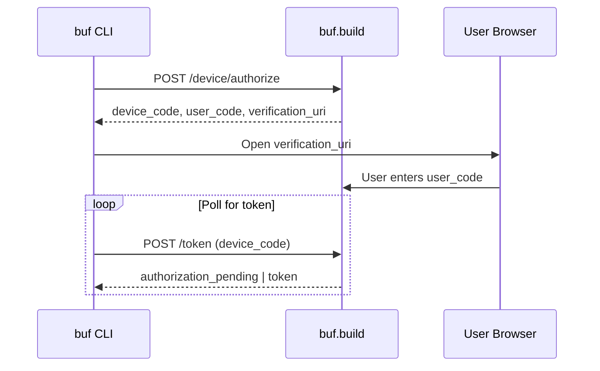

# Security Considerations in Buf

**Series:** Buf Deep Dive (6 of 6)
**Commit SHA:** `e68c306ab3b6c39eef5abc23725d3e33d4a49cd4`

---

## What You'll Learn

- Authentication mechanisms (OAuth2, tokens, netrc)
- Credential handling and storage
- TLS configuration
- Input validation patterns

---

## Introduction

Security is paramount for any tool that handles authentication, network communication, and code generation. Buf takes security seriously, implementing industry-standard patterns for credential handling, TLS, and input validation.

In this final post, we'll examine how Buf protects user credentials, validates inputs, and maintains secure communication with the BSR.

---

## Authentication Mechanisms

Buf supports multiple authentication methods for BSR access:

### 1. OAuth2 Device Flow

For interactive login, Buf uses the OAuth2 Device Authorization Grant (RFC 6749):

```go
// private/pkg/oauth2/oauth2.go
type DeviceAuthorization struct {
    DeviceCode              string `json:"device_code"`
    UserCode                string `json:"user_code"`
    VerificationURI         string `json:"verification_uri"`
    VerificationURIComplete string `json:"verification_uri_complete"`
    ExpiresIn               int    `json:"expires_in"`
    Interval                int    `json:"interval"`
}
```

The flow:



Implementation details:

```go
// private/pkg/oauth2/client.go
func (c *Client) GetToken(ctx context.Context, auth *DeviceAuthorization) (string, error) {
    interval := time.Duration(auth.Interval) * time.Second

    for {
        select {
        case <-ctx.Done():
            return "", ctx.Err()
        case <-time.After(interval):
        }

        token, err := c.pollToken(ctx, auth.DeviceCode)
        if err != nil {
            var oauthErr *OAuthError
            if errors.As(err, &oauthErr) {
                switch oauthErr.Error {
                case "authorization_pending":
                    continue
                case "slow_down":
                    interval = min(interval+5*time.Second, 30*time.Second)
                    continue
                }
            }
            return "", err
        }
        return token, nil
    }
}
```

**Security features:**
- Exponential backoff for rate limiting
- Maximum poll interval (30s)
- Payload size limit (1MB)

### 2. Token-Based Authentication

For non-interactive use (CI/CD), tokens are provided via:

**Environment variable:**
```bash
export BUF_TOKEN=your-token-here
buf push
```

**Multiple remotes:**
```bash
export BUF_TOKEN=token1@buf.build,token2@custom.registry
```

Implementation:

```go
// private/pkg/httpauth/static_token_provider.go
func NewStaticTokenProvider(tokens string) (TokenProvider, error) {
    if tokens == "" {
        return nil, nil
    }

    // Validate format
    for _, part := range strings.Split(tokens, ",") {
        if strings.Count(part, "@") > 1 {
            return nil, errors.New("invalid token format")
        }
        token := strings.Split(part, "@")[0]
        if strings.ContainsAny(token, "@,") {
            return nil, errors.New("token contains invalid characters")
        }
    }

    return &staticTokenProvider{tokens: parseTokens(tokens)}, nil
}
```

### 3. Netrc File

Traditional Unix credential storage:

```go
// private/pkg/netrc/netrc.go
func GetMachine(container app.Container, address string) (_ Machine, retErr error) {
    netrcPath, err := getNetrcPath(container)
    if err != nil {
        return nil, err
    }

    netrc, err := parseNetrcFile(netrcPath)
    if err != nil {
        return nil, err
    }

    // Look up by address, fall back to default
    if machine := netrc.Machine(address); machine != nil {
        return machine, nil
    }
    return netrc.Machine("default"), nil
}
```

---

## Credential Storage Security

### File Permissions

Netrc files are created with restricted permissions:

```go
// private/pkg/netrc/netrc.go:131-152
const fileMode = 0600  // Owner read/write only

func PutMachines(container app.Container, machines ...Machine) error {
    netrcPath, err := getNetrcPath(container)
    if err != nil {
        return err
    }

    // ... update netrc content

    return os.WriteFile(netrcPath, []byte(netrcStruct.Render()), fileMode)
}
```

### Never Log Credentials

The debug logging interceptor explicitly excludes sensitive data:

```go
// private/bufpkg/bufconnect/interceptors.go
func NewDebugLoggingInterceptor(logger *slog.Logger) connect.UnaryInterceptorFunc {
    return func(next connect.UnaryFunc) connect.UnaryFunc {
        return func(ctx context.Context, req connect.AnyRequest) (connect.AnyResponse, error) {
            // Log metadata but NOT authorization headers
            logger.Debug("RPC call",
                "procedure", req.Spec().Procedure,
                "peer", req.Peer().Addr,
                "request_size", proto.Size(req.Any()),
            )
            // Token is NOT logged
            return next(ctx, req)
        }
    }
}
```

### Error Messages Without Secrets

Authentication errors provide helpful guidance without exposing credentials:

```go
// private/buf/bufcli/errors.go
func NewAuthenticationError(remote string, cause error) error {
    return fmt.Errorf(
        "authentication failed for %q\n"+
        "Hint: Run 'buf registry login %s' or set BUF_TOKEN environment variable",
        remote,
        remote,
    )
    // Note: cause is wrapped but token value is NOT included
}
```

---

## TLS Configuration

Buf has comprehensive TLS support with sensible defaults:

### Default Configuration

```go
// private/pkg/cert/certclient/certclient.go
func NewClientTLSConfig(ctx context.Context, container app.Container) (*tls.Config, error) {
    // Use system certificate pool by default
    certPool, err := x509.SystemCertPool()
    if err != nil {
        return nil, err
    }

    return &tls.Config{
        RootCAs: certPool,
    }, nil
}
```

### Custom Certificates

For internal/custom CAs:

```go
// Custom root CA
config.tls.root_certs = "~/.buf/tls/root.pem"

// Or via environment
export BUF_TLS_ROOT_CERTS=/path/to/ca.pem
```

### Client Certificates (mTLS)

```go
// private/buf/bufcurl/tls.go
type TLSSettings struct {
    KeyFile    string  // Client private key
    CertFile   string  // Client certificate
    CACertFile string  // Custom CA certificate
    ServerName string  // SNI hostname
    Insecure   bool    // Skip verification (DANGEROUS)
}

func BuildTLSConfig(settings TLSSettings) (*tls.Config, error) {
    config := &tls.Config{}

    // Load client certificate
    if settings.CertFile != "" && settings.KeyFile != "" {
        cert, err := tls.LoadX509KeyPair(settings.CertFile, settings.KeyFile)
        if err != nil {
            return nil, err
        }
        config.Certificates = []tls.Certificate{cert}
    }

    // Load custom CA
    if settings.CACertFile != "" {
        caCert, err := os.ReadFile(settings.CACertFile)
        if err != nil {
            return nil, err
        }
        certPool := x509.NewCertPool()
        certPool.AppendCertsFromPEM(caCert)
        config.RootCAs = certPool
    }

    return config, nil
}
```

### Manual Certificate Verification

For advanced scenarios, Buf performs manual verification:

```go
// private/buf/bufcurl/tls.go:60-116
func buildManualVerifyTLSConfig(settings TLSSettings) (*tls.Config, error) {
    return &tls.Config{
        InsecureSkipVerify: true,  // We'll verify manually
        VerifyConnection: func(cs tls.ConnectionState) error {
            if settings.Insecure {
                return nil
            }

            // Verify certificate chain
            opts := x509.VerifyOptions{
                Roots:         certPool,
                Intermediates: intermediates,
            }
            _, err := cs.PeerCertificates[0].Verify(opts)
            if err != nil {
                return err
            }

            // Verify hostname
            return cs.PeerCertificates[0].VerifyHostname(serverName)
        },
    }, nil
}
```

---

## Input Validation

### Hostname Validation

Comprehensive validation prevents injection and confusion attacks:

```go
// private/pkg/netext/netext.go
func ValidateHostname(hostname string) (string, error) {
    hostname = strings.ToLower(strings.TrimSpace(hostname))

    // Length checks
    if len(hostname) < 2 || len(hostname) > 254 {
        return "", fmt.Errorf("hostname must be 2-254 characters")
    }

    // Check for IP address
    if ip := net.ParseIP(hostname); ip != nil {
        return hostname, nil
    }

    // Validate domain name format
    segments := strings.Split(hostname, ".")
    for _, segment := range segments {
        if len(segment) == 0 || len(segment) > 63 {
            return "", fmt.Errorf("invalid segment length")
        }
        if segment[0] == '-' || segment[len(segment)-1] == '-' {
            return "", fmt.Errorf("segment cannot start/end with hyphen")
        }
        for _, r := range segment {
            if !isAllowedHostnameChar(r) {
                return "", fmt.Errorf("invalid character: %c", r)
            }
        }
    }

    return hostname, nil
}
```

### Token Validation

Tokens are validated for format and safety:

```go
// private/pkg/httpauth/static_token_provider.go
func validateToken(token string) error {
    if token == "" {
        return errors.New("token cannot be empty")
    }
    if strings.ContainsAny(token, "@,:") {
        return errors.New("token contains reserved characters")
    }
    return nil
}
```

### Path Validation

All file paths are normalized and validated:

```go
// private/pkg/normalpath/normalpath.go
func NormalizeAndValidate(path string) (string, error) {
    // Clean the path
    path = filepath.Clean(path)

    // Check for path traversal
    if strings.Contains(path, "..") {
        return "", errors.New("path traversal not allowed")
    }

    // Check for absolute paths where relative expected
    if filepath.IsAbs(path) {
        return "", errors.New("absolute paths not allowed")
    }

    return path, nil
}
```

---

## Security Best Practices in Buf

### 1. HTTPS-Only for Authentication

Basic auth is only sent over HTTPS:

```go
// private/pkg/httpauth/netrc_authenticator.go
func (a *netrcAuthenticator) Authenticate(req *http.Request) bool {
    if req.URL.Scheme != "https" {
        return false  // Never send credentials over HTTP
    }
    // ... add authentication
    return true
}
```

### 2. Insecure Mode Warnings

When TLS verification is disabled:

```go
// Users must explicitly opt-in
buf curl --insecure https://example.com/service/Method

// With mutual exclusion
if insecure && caCertFile != "" {
    return errors.New("--insecure and --cacert are mutually exclusive")
}
```

### 3. Proxy Configuration

Buf respects system proxy settings safely:

```go
// private/pkg/transport/http/httpclient/httpclient.go
func NewClient(tlsConfig *tls.Config) *http.Client {
    return &http.Client{
        Transport: &http.Transport{
            TLSClientConfig: tlsConfig,
            Proxy:           http.ProxyFromEnvironment,
        },
    }
}
```

### 4. Payload Size Limits

Prevent DoS through large payloads:

```go
// private/pkg/oauth2/client.go:35
const maxPayloadSize = 1 << 20  // 1MB

func (c *Client) parseResponse(resp *http.Response) (*TokenResponse, error) {
    body := io.LimitReader(resp.Body, maxPayloadSize)
    // ...
}
```

---

## Security Checklist for Buf Users

### Authentication

- [ ] Use `BUF_TOKEN` in CI/CD (not netrc)
- [ ] Rotate tokens periodically
- [ ] Use separate tokens per environment
- [ ] Avoid tokens in shell history (`read -s`)

### TLS

- [ ] Keep default TLS settings
- [ ] Only use `--insecure` for local testing
- [ ] Add custom CAs to system trust store when possible
- [ ] Use mTLS for private BSR instances

### General

- [ ] Keep buf CLI updated
- [ ] Review generated code for vulnerabilities
- [ ] Use `buf lint` security-related rules
- [ ] Audit third-party plugins before use

---

## Potential Security Improvements

### 1. Token Encryption at Rest

Currently, tokens are stored in plaintext in netrc:

```
machine buf.build
  password <token>
```

**Improvement:** Integrate with system keyring:
- macOS Keychain
- Windows Credential Manager
- Linux Secret Service (libsecret)

### 2. Token Expiration Handling

Currently, long-lived tokens are used. Consider:
- Short-lived tokens with refresh
- Automatic rotation
- Expiration warnings

### 3. Audit Logging

Add security event logging:
- Authentication attempts
- Failed validations
- TLS errors

### 4. Plugin Sandboxing

WASM plugins run in sandbox, but local plugins don't:
- Consider more restrictive execution
- Plugin signature verification
- Capability-based permissions

---

## Key Takeaways

1. **Multiple auth methods** - OAuth2, tokens, netrc for different use cases

2. **Credentials are protected** - File permissions, no logging, safe errors

3. **TLS is comprehensive** - System certs, custom CAs, mTLS support

4. **Input validation is thorough** - Hostnames, tokens, paths all validated

5. **HTTPS is required** - Basic auth only over secure connections

---

## Series Conclusion

Over these six posts, we've explored Buf's architecture, patterns, and internals. Key themes throughout:

- **Clean architecture** enables maintainability and testing
- **Explicit patterns** (Provider, Option) avoid magic
- **Comprehensive tooling** (lint, breaking, generate) solves real problems
- **Security-first design** protects users and credentials
- **Performance optimization** makes tools pleasant to use

Buf demonstrates what a mature, well-engineered CLI tool looks like. Whether you're contributing to Buf or building your own tools, these patterns are worth studying.

---

## Code References

- OAuth2 Client: [`private/pkg/oauth2/client.go`](https://github.com/bufbuild/buf/blob/e68c306ab3b6c39eef5abc23725d3e33d4a49cd4/private/pkg/oauth2/client.go)
- Netrc: [`private/pkg/netrc/netrc.go`](https://github.com/bufbuild/buf/blob/e68c306ab3b6c39eef5abc23725d3e33d4a49cd4/private/pkg/netrc/netrc.go)
- HTTP Auth: [`private/pkg/httpauth/httpauth.go`](https://github.com/bufbuild/buf/blob/e68c306ab3b6c39eef5abc23725d3e33d4a49cd4/private/pkg/httpauth/httpauth.go)
- TLS Configuration: [`private/buf/bufcurl/tls.go`](https://github.com/bufbuild/buf/blob/e68c306ab3b6c39eef5abc23725d3e33d4a49cd4/private/buf/bufcurl/tls.go)
- Hostname Validation: [`private/pkg/netext/netext.go`](https://github.com/bufbuild/buf/blob/e68c306ab3b6c39eef5abc23725d3e33d4a49cd4/private/pkg/netext/netext.go)
- Interceptors: [`private/bufpkg/bufconnect/interceptors.go`](https://github.com/bufbuild/buf/blob/e68c306ab3b6c39eef5abc23725d3e33d4a49cd4/private/bufpkg/bufconnect/interceptors.go)

---

*Thank you for reading the Buf Deep Dive series!*
