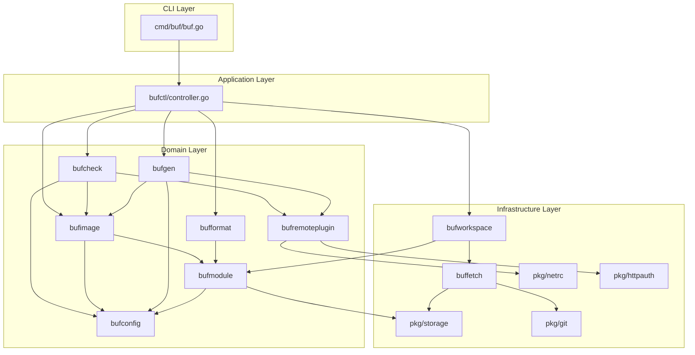
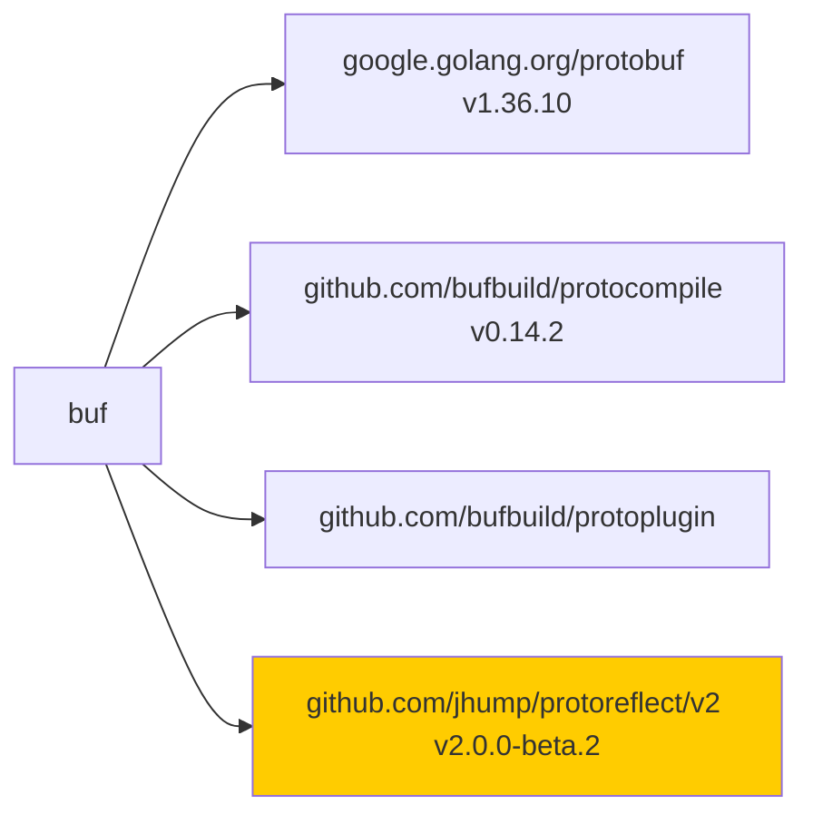
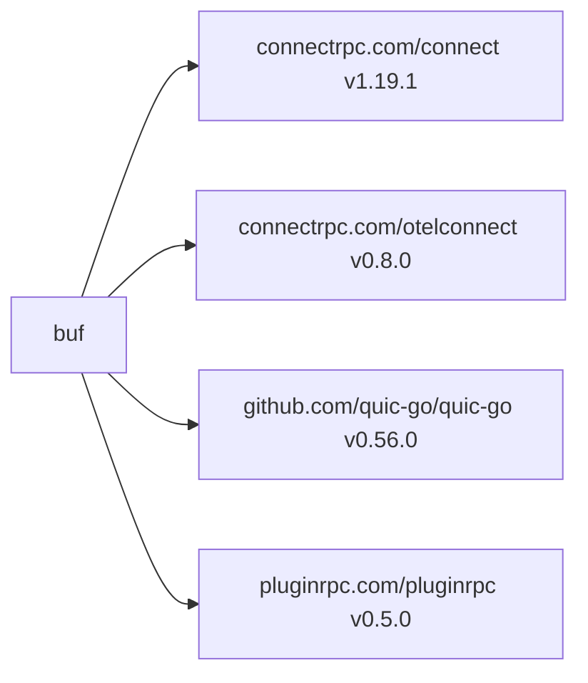
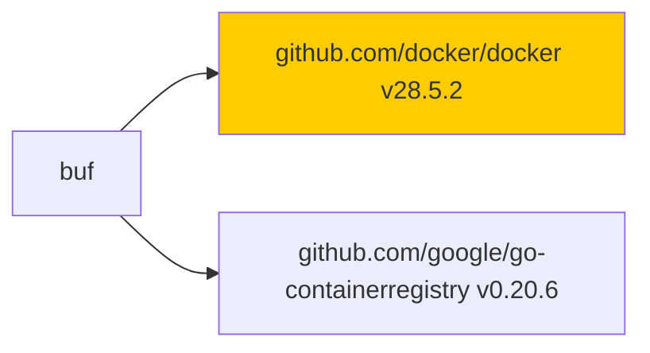
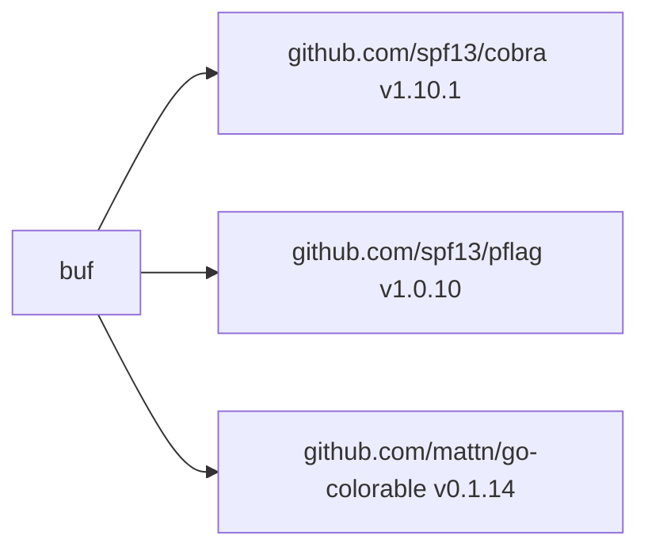
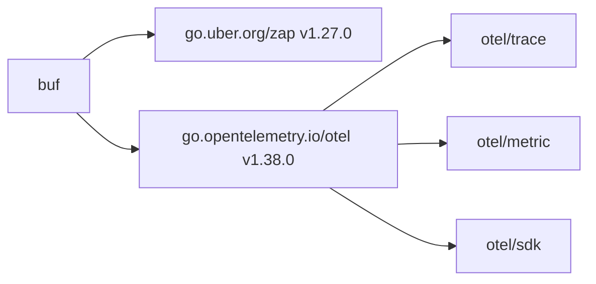

# Buf Dependency Graph

**Commit SHA:** `e68c306ab3b6c39eef5abc23725d3e33d4a49cd4`

---

## Overview

Buf has **162 total modules** with **48 direct dependencies** organized into a sophisticated dependency ecosystem.

---

## Internal Package Dependency Graph



---

## External Dependencies by Category

### 1. Protobuf Ecosystem



**Purpose:** Core protobuf compilation and reflection

### 2. RPC & Networking



**Purpose:** Service-to-service communication and plugin execution

### 3. Container & Registry



**Purpose:** Docker-based plugin execution

### 4. CLI Framework



**Purpose:** CLI application structure

### 5. Observability



**Purpose:** Logging, tracing, metrics

---

## Complete Direct Dependencies

| Module | Version | Category | Purpose |
|--------|---------|----------|---------|
| google.golang.org/protobuf | v1.36.10 | Protobuf | Protocol Buffers library |
| github.com/bufbuild/protocompile | v0.14.2-dev | Protobuf | Pure-Go protobuf compiler |
| github.com/bufbuild/protoplugin | v0.0.0-dev | Protobuf | Plugin framework |
| github.com/jhump/protoreflect/v2 | v2.0.0-beta.2 | Protobuf | Proto reflection |
| connectrpc.com/connect | v1.19.1 | RPC | Modern RPC framework |
| connectrpc.com/otelconnect | v0.8.0 | RPC | OpenTelemetry integration |
| pluginrpc.com/pluginrpc | v0.5.0 | RPC | Plugin RPC |
| github.com/quic-go/quic-go | v0.56.0 | Network | QUIC transport |
| github.com/docker/docker | v28.5.2+incompatible | Container | Docker API client |
| github.com/google/go-containerregistry | v0.20.6 | Container | OCI registry |
| github.com/spf13/cobra | v1.10.1 | CLI | Command framework |
| github.com/spf13/pflag | v1.0.10 | CLI | Flag parsing |
| github.com/mattn/go-colorable | v0.1.14 | CLI | Terminal colors |
| go.lsp.dev/jsonrpc2 | v0.10.0 | LSP | JSON-RPC 2.0 |
| go.lsp.dev/protocol | v0.12.0 | LSP | LSP protocol |
| go.lsp.dev/uri | v0.3.0 | LSP | URI handling |
| github.com/klauspost/compress | v1.18.1 | Compress | High-perf compression |
| github.com/klauspost/pgzip | v1.2.6 | Compress | Parallel gzip |
| github.com/google/cel-go | v0.26.1 | Eval | Expression language |
| github.com/tetratelabs/wazero | v1.9.0 | WASM | WebAssembly runtime |
| go.uber.org/zap | v1.27.0 | Logging | Structured logging |
| golang.org/x/crypto | v0.43.0 | Crypto | Cryptography |
| golang.org/x/mod | v0.29.0 | Go | Module utilities |
| golang.org/x/sync | v0.18.0 | Go | Sync primitives |
| golang.org/x/term | v0.36.0 | Go | Terminal handling |
| golang.org/x/tools | v0.38.0 | Go | Go tooling |
| github.com/google/uuid | v1.6.0 | Util | UUID generation |
| github.com/gofrs/flock | v0.13.0 | Util | File locking |
| github.com/jdx/go-netrc | v1.0.0 | Util | Netrc parsing |
| gopkg.in/yaml.v3 | v3.0.1 | Util | YAML parsing |
| github.com/stretchr/testify | v1.11.1 | Testing | Assertions |
| github.com/google/go-cmp | v0.7.0 | Testing | Comparisons |
| github.com/go-chi/chi/v5 | v5.2.3 | Web | HTTP router |
| github.com/rs/cors | v1.11.1 | Web | CORS middleware |

### Buf Internal Modules

| Module | Version | Purpose |
|--------|---------|---------|
| buf.build/go/app | v0.2.0 | Application framework |
| buf.build/go/bufplugin | v0.9.0 | Plugin system |
| buf.build/go/bufprivateusage | v0.1.0 | Usage tracking |
| buf.build/go/protovalidate | v1.0.0 | Proto validation |
| buf.build/go/protoyaml | v0.6.0 | Proto YAML |
| buf.build/go/spdx | v0.2.0 | License detection |
| buf.build/go/standard | v0.1.0 | Standard utilities |

---

## Dependency Health Matrix

| Status | Count | Examples |
|--------|-------|----------|
| Stable (v1+) | 28 | connect v1.19.1, zap v1.27.0 |
| Pre-stable (v0.x) | 17 | otelconnect v0.8.0 |
| +incompatible | 3 | docker/docker |
| Pseudo-versions | 7 | protocompile |
| Beta | 1 | protoreflect/v2 |

### Dependencies to Monitor

| Dependency | Status | Action |
|------------|--------|--------|
| jhump/protoreflect/v2 | v2.0.0-beta.2 | Watch for stable release |
| github.com/bufbuild/protocompile | pseudo-version | Monitor for tags |
| docker/docker | +incompatible | Unavoidable (Docker's choice) |

---

## Version Pinning Strategy

Buf uses **semantic versioning** with:

1. **Direct dependencies** - Pinned to specific versions in go.mod
2. **Indirect dependencies** - Managed via go.sum checksums
3. **Minimum versions** - Go 1.23+ required (go.mod directive)

```go
// go.mod
module github.com/bufbuild/buf

go 1.24.0

require (
    connectrpc.com/connect v1.19.1
    github.com/spf13/cobra v1.10.1
    // ...
)
```

---

## Security Posture

| Check | Status |
|-------|--------|
| Known CVEs | None identified |
| Deprecated packages | None in direct deps |
| Outdated crypto | golang.org/x/crypto v0.43.0 (latest) |
| Hardcoded secrets | None found |

---

## License Compatibility

All dependencies use permissive licenses compatible with Apache 2.0:

| License | Count | Notable |
|---------|-------|---------|
| Apache-2.0 | 25+ | google.golang.org/*, buf.build/* |
| MIT | 15+ | spf13/*, stretchr/testify |
| BSD-3-Clause | 10+ | golang.org/x/* |
| BSD-2-Clause | 5+ | Various |

---

## Transitive Dependencies

Total: **162 modules**

### OpenTelemetry Stack (11 modules)
- go.opentelemetry.io/otel v1.38.0
- go.opentelemetry.io/otel/trace
- go.opentelemetry.io/otel/metric
- go.opentelemetry.io/otel/sdk
- ... (OTLP exporters)

### Docker Ecosystem (~20 modules)
- github.com/docker/cli
- github.com/docker/distribution
- github.com/moby/*
- github.com/containerd/*

### gRPC Ecosystem (indirect)
- google.golang.org/grpc v1.75.0
- grpc-gateway v2

---

*Generated from commit `e68c306ab3b6c39eef5abc23725d3e33d4a49cd4`*
